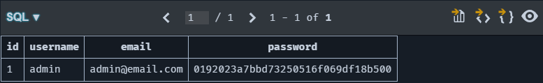

# Flask SQL Injection Project

This project is a Flask web application that demonstrates SQL injection vulnerabilities and their prevention.

## Screenshots

### Registration Page
This page allows users to register by providing a username, email, and password.


### Database View
This view shows the database content, which can be manipulated through SQL injection.


### Login Page
Users can log in using their credentials. This page is vulnerable to SQL injection attacks.


### Server Logs
The server logs show the running SQL script that gets injected by the attacker.


### Admin Dashboard
The hacker gains access to the admin dashboard through SQL injection.


## Setting Up the Environment

To set up a virtual environment and install the required packages, follow these steps:

1. Create a virtual environment:
    ```sh
    python -m venv venv
    ```

2. Activate the virtual environment:

    - On Windows:
        ```sh
        venv\Scripts\activate
        ```
    - On macOS and Linux:
        ```sh
        source venv/bin/activate
        ```

3. Install the required packages:
    ```sh
    pip install -r requirements.txt
    ```

## Running the Application
To run the application, use the following command:

```sh
flask run
```

## Project Structure

- `app.py`: Main application file containing the Flask app and database functions.
- `utils.py`: Utility functions such as password hashing and key generation.
- `templates/`: HTML templates for rendering web pages.
- `static/`: Static files such as CSS and images.
- `requirements.txt`: Project dependencies.
- `README.md`: Project documentation.
- `screenshots/`: Folder containing screenshots used in the README.